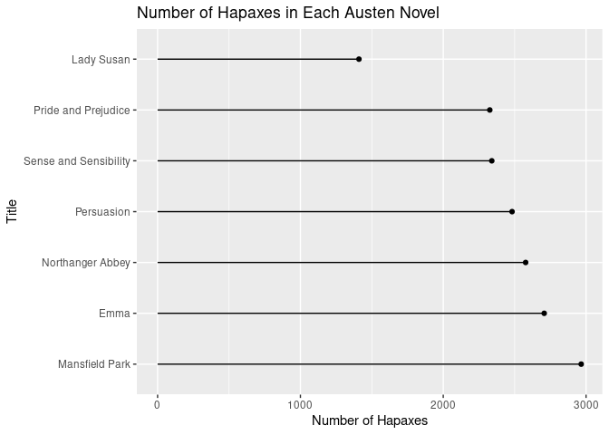

# Introduction
A _hapax_ is (or _hapax legomenon_) is a word that only occurs once in
a work or collection of works.
See https://en.wikipedia.org/wiki/Hapax_legomenon

How common are hapaxes in works of literature?
With access to digital versions of the works,
finding hapaxes should be a straighforward computational task.

This paper considers hapaxes in the works by the Jane Austen.
Austen's works are all available from Project Gutenberg
(https://en.wikipedia.org/wiki/Project_Gutenberg)

The R CRAN package `gutenburgr` provides an API to works from
Project Gutenberg.
The R CRAN package `tidytext` provides functions to process the text.

## Setup

The packages we use.

```r
library(dplyr, quietly=TRUE, warn.conflicts=FALSE)
library(ggplot2, quietly=TRUE, warn.conflicts=FALSE)
library(gutenbergr)
library(tidytext)
```

# Data
Get the works of Jane Austen from Project Gutenberg.


```r
austen_works <- gutenberg_works(author == "Austen, Jane")
```


```r
nrow(austen_works)
```

```
## [1] 10
```

```r
names(austen_works)
```

```
## [1] "gutenberg_id"        "title"               "author"             
## [4] "gutenberg_author_id" "language"            "gutenberg_bookshelf"
## [7] "rights"              "has_text"
```

```r
austen_works[["title"]]
```

```
##  [1] "Persuasion"                                                                                              
##  [2] "Northanger Abbey"                                                                                        
##  [3] "Mansfield Park"                                                                                          
##  [4] "Emma"                                                                                                    
##  [5] "Sense and Sensibility"                                                                                   
##  [6] "Lady Susan"                                                                                              
##  [7] "Love and Freindship [sic]"                                                                               
##  [8] "Pride and Prejudice"                                                                                     
##  [9] "The Complete Project Gutenberg Works of Jane Austen\nA Linked Index of all PG Editions of Jane Austen"   
## [10] "The Letters of Jane Austen\r\nSelected from the compilation of her great nephew, Edward, Lord Bradbourne"
```

Only look at individual Austen's novels:


```r
austen_works <- austen_works[-c(9:10),]
austen_works[["title"]]
```

```
## [1] "Persuasion"                "Northanger Abbey"         
## [3] "Mansfield Park"            "Emma"                     
## [5] "Sense and Sensibility"     "Lady Susan"               
## [7] "Love and Freindship [sic]" "Pride and Prejudice"
```


```r
austen_books <- gutenberg_download(austen_works[["gutenberg_id"]],
  meta_fields="title",
  mirror="http://mirrors.xmission.com/gutenberg/")
```


```r
nrow(austen_books)
```

```
## [1] 81275
```

```r
names(austen_books)
```

```
## [1] "gutenberg_id" "text"         "title"
```

```r
austen_books
```

```
## # A tibble: 81,275 × 3
##    gutenberg_id text          title     
##           <int> <chr>         <chr>     
##  1          105 "Persuasion"  Persuasion
##  2          105 ""            Persuasion
##  3          105 ""            Persuasion
##  4          105 "by"          Persuasion
##  5          105 ""            Persuasion
##  6          105 "Jane Austen" Persuasion
##  7          105 ""            Persuasion
##  8          105 "(1818)"      Persuasion
##  9          105 ""            Persuasion
## 10          105 ""            Persuasion
## # … with 81,265 more rows
```

# Word Analysis

Get words in each book,
drop any formatting characters (e.g. \_) around the words.
This produces a `tibble` with each observation (row)
containg the book title and the word.

```r
words <- austen_books |>
  unnest_tokens(word, text) |>
  mutate(word = stringr::str_extract(word, "[a-z']+"))
```


```r
nrow(words)
```

```
## [1] 782299
```

```r
words
```

```
## # A tibble: 782,299 × 3
##    gutenberg_id title      word      
##           <int> <chr>      <chr>     
##  1          105 Persuasion persuasion
##  2          105 Persuasion by        
##  3          105 Persuasion jane      
##  4          105 Persuasion austen    
##  5          105 Persuasion <NA>      
##  6          105 Persuasion chapter   
##  7          105 Persuasion <NA>      
##  8          105 Persuasion sir       
##  9          105 Persuasion walter    
## 10          105 Persuasion elliot    
## # … with 782,289 more rows
```

Count words per book, dropping "stop" words first.

```r
book_word_counts <- words |>
  anti_join(stop_words, by="word") |>
  count(title, word, sort=TRUE)
```


```r
book_word_counts
```

```
## # A tibble: 42,326 × 3
##    title                 word          n
##    <chr>                 <chr>     <int>
##  1 Mansfield Park        fanny       925
##  2 Emma                  emma        865
##  3 Sense and Sensibility elinor      685
##  4 Pride and Prejudice   elizabeth   634
##  5 Mansfield Park        crawford    605
##  6 Emma                  miss        602
##  7 Sense and Sensibility marianne    566
##  8 Emma                  harriet     506
##  9 Northanger Abbey      catherine   487
## 10 Persuasion            anne        447
## # … with 42,316 more rows
```
## Words Per Book

```r
words_per_book <- book_word_counts |>
  group_by(title) |>
  summarise(total_words = sum(n), unique_words = length(word))
```


```r
words_per_book
```

```
## # A tibble: 8 × 3
##   title                     total_words unique_words
##   <chr>                           <int>        <int>
## 1 Emma                            46549         6565
## 2 Lady Susan                       7157         2495
## 3 Love and Freindship [sic]       11209         3718
## 4 Mansfield Park                  47466         7220
## 5 Northanger Abbey                23816         5495
## 6 Persuasion                      25487         5303
## 7 Pride and Prejudice             37010         5736
## 8 Sense and Sensibility           36388         5794
```

## Hapax in Each Book

Hapax (count == 1) words by book:

```r
book_hapax_words <- book_word_counts |>
  filter(n == 1) |>
  arrange(word)
```


```r
nrow(book_hapax_words)
```

```
## [1] 18773
```

```r
book_hapax_words
```

```
## # A tibble: 18,773 × 3
##    title                     word          n
##    <chr>                     <chr>     <int>
##  1 Persuasion                a'n't         1
##  2 Sense and Sensibility     abandoned     1
##  3 Love and Freindship [sic] abashed       1
##  4 Mansfield Park            abashed       1
##  5 Mansfield Park            abatement     1
##  6 Northanger Abbey          abatement     1
##  7 Pride and Prejudice       abatement     1
##  8 Sense and Sensibility     abatement     1
##  9 Mansfield Park            abating       1
## 10 Mansfield Park            abbey         1
## # … with 18,763 more rows
```
  
Number of hapaxes per book,
combined with total number of words and number of unique words.


```r
book_hapax_words <- book_hapax_words |> group_by(title) |>
  summarise(n_hapax = n()) |>
  ungroup() |>
  left_join(words_per_book, by="title") |>
  mutate(percent_hapax_total = n_hapax / total_words * 100,
    percent_hapax_unique = n_hapax / unique_words * 100)
```

```r
knitr::kable(book_hapax_words, format.args=list(digits = 4))
```


|title                     | n_hapax| total_words| unique_words| percent_hapax_total| percent_hapax_unique|
|:-------------------------|-------:|-----------:|------------:|-------------------:|--------------------:|
|Emma                      |    2707|       46549|         6565|               5.815|                41.23|
|Lady Susan                |    1410|        7157|         2495|              19.701|                56.51|
|Love and Freindship [sic] |    1965|       11209|         3718|              17.531|                52.85|
|Mansfield Park            |    2966|       47466|         7220|               6.249|                41.08|
|Northanger Abbey          |    2577|       23816|         5495|              10.820|                46.90|
|Persuasion                |    2482|       25487|         5303|               9.738|                46.80|
|Pride and Prejudice       |    2326|       37010|         5736|               6.285|                40.55|
|Sense and Sensibility     |    2340|       36388|         5794|               6.431|                40.39|


```r
book_hapax_words |> group_by(title) |>
  summarise(n_hapax = n()) |>
  arrange(desc(n_hapax)) |>
  ggplot(aes(y=factor(title, levels=title), x=n_hapax)) +
    geom_point() +
    geom_segment(aes(x=0, xend=n_hapax, y=title, yend=title)) +
    ggtitle("Number of Hapaxes in Each Austen Novel") +
    ylab("Title") +
    xlab("Number of Hapaxes")
```

<!-- -->

## Hapax for All Austen Works

Hapax for all Austen works.

```r
works_hapax_words <- words |>
  anti_join(stop_words, by="word") |>
  count(word, sort=TRUE) |>
  filter(n < 2)
```


```r
# Number of hapaxes for all of Austen works
nrow(works_hapax_words)
```

```
## [1] 4617
```

A sample of hapaxes across all of Austen's works:from Austen's works:

```r
set.seed(42)
sample(works_hapax_words[["word"]], 50)
```

```
##  [1] "morley"       "thoroughfare" "lefroy"       "dew"          "drakes"      
##  [6] "chilling"     "incompetency" "sublime"      "bely"         "undirected"  
## [11] "supped"       "havoc"        "coze"         "crushed"      "decently"    
## [16] "identify"     "tack"         "corrective"   "superfine"    "augmenting"  
## [21] "brickbat"     "imprudently"  "banking"      "sweetmeats"   "magnificence"
## [26] "smoking"      "contusion"    "deafer"       "faintly"      "jeffereys"   
## [31] "minister"     "richard's"    "portmanteau"  "commandingly" "curls"       
## [36] "remarked"     "chestnut"     "unseasonably" "unbiassed"    "enrolled"    
## [41] "vulnerable"   "packs"        "default"      "busiest"      "abydos"      
## [46] "wording"      "aisles"       "informality"  "emphatic"     "freak"
```
