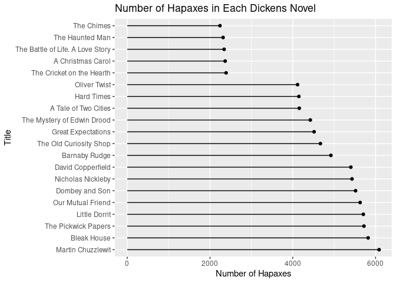

# Introduction
A _hapax_ is (or _hapax legomenon_) is a word that only occurs once in
a work or collection of works.
See https://en.wikipedia.org/wiki/Hapax_legomenon

How common are hapaxes in works of literature?
With access to digital versions of the works,
finding hapaxes should be a straighforward computational task.

This paper considers hapaxes in the works by the Charles Dickens.
Dickens's works are all available from Project Gutenberg
(https://en.wikipedia.org/wiki/Project_Gutenberg)

The R CRAN package `gutenburgr` provides an API to works from
Project Gutenberg.
The R CRAN package `tidytext` provides functions to process the text.

## Setup

The packages we use.

```r
library(dplyr, quietly=TRUE, warn.conflicts=FALSE)
library(ggplot2, quietly=TRUE, warn.conflicts=FALSE)
library(gutenbergr)
library(tidytext)
```

# Data
Get the works of Charles Dickens from Project Gutenberg.


```r
dickens_works <- gutenberg_works(author == "Dickens, Charles")
```

Novels by Dickens (from Wikipedia):

```r
dickens_novel_titles <- scan(here::here("data", "dickens_novels.txt"),
  what="", sep="\n")
```

Novels from Project Gutenberg.

```r
indx_novels <- match(dickens_novel_titles, dickens_works[["title"]])
missing_novels <- dickens_novel_titles[is.na(indx_novels)]
indx_novels <- indx_novels[!is.na(indx_novels)]
indx_missing <- sapply(missing_novels,
  function(x) grep(x, dickens_works[["title"]]))
indx_novels <- c(indx_novels, indx_missing)
dickens_works[indx_novels, "title"]
```

```
## # A tibble: 20 × 1
##    title                                                                        
##    <chr>                                                                        
##  1 "The Pickwick Papers"                                                        
##  2 "Oliver Twist"                                                               
##  3 "Nicholas Nickleby"                                                          
##  4 "The Old Curiosity Shop"                                                     
##  5 "Martin Chuzzlewit"                                                          
##  6 "A Christmas Carol"                                                          
##  7 "The Cricket on the Hearth"                                                  
##  8 "The Haunted Man and the Ghost's Bargain"                                    
##  9 "Dombey and Son"                                                             
## 10 "David Copperfield"                                                          
## 11 "Bleak House"                                                                
## 12 "Hard Times"                                                                 
## 13 "Little Dorrit"                                                              
## 14 "A Tale of Two Cities"                                                       
## 15 "Great Expectations"                                                         
## 16 "Our Mutual Friend"                                                          
## 17 "The Mystery of Edwin Drood"                                                 
## 18 "Barnaby Rudge: A Tale of the Riots of 'Eighty"                              
## 19 "The Chimes\r\nA Goblin Story of Some Bells That Rang an Old Year out and a …
## 20 "The Battle of Life. A Love Story"
```

Download Dickens novels from Project Gutenberg.

```r
dickens_books <- gutenberg_download(dickens_works[indx_novels, "gutenberg_id"],
  meta_fields="title",
  mirror="http://mirrors.xmission.com/gutenberg/")
```


```r
nrow(dickens_books)
```

```
## [1] 451952
```

```r
names(dickens_books)
```

```
## [1] "gutenberg_id" "text"         "title"
```

```r
dickens_books
```

```
## # A tibble: 451,952 × 3
##    gutenberg_id text                               title               
##           <int> <chr>                              <chr>               
##  1           98 "A TALE OF TWO CITIES"             A Tale of Two Cities
##  2           98 ""                                 A Tale of Two Cities
##  3           98 "A STORY OF THE FRENCH REVOLUTION" A Tale of Two Cities
##  4           98 ""                                 A Tale of Two Cities
##  5           98 "By Charles Dickens"               A Tale of Two Cities
##  6           98 ""                                 A Tale of Two Cities
##  7           98 ""                                 A Tale of Two Cities
##  8           98 "CONTENTS"                         A Tale of Two Cities
##  9           98 ""                                 A Tale of Two Cities
## 10           98 ""                                 A Tale of Two Cities
## # … with 451,942 more rows
```

# Word Analysis

Get words in each book,
drop any formatting characters (e.g. \_) around the words.
This produces a `tibble` with each observation (row)
containg the book title and the word.

```r
words <- dickens_books |>
  unnest_tokens(word, text) |>
  mutate(word = stringr::str_extract(word, "[a-z']+"))
```


```r
nrow(words)
```

```
## [1] 4037486
```

```r
words
```

```
## # A tibble: 4,037,486 × 3
##    gutenberg_id title                word  
##           <int> <chr>                <chr> 
##  1           98 A Tale of Two Cities a     
##  2           98 A Tale of Two Cities tale  
##  3           98 A Tale of Two Cities of    
##  4           98 A Tale of Two Cities two   
##  5           98 A Tale of Two Cities cities
##  6           98 A Tale of Two Cities a     
##  7           98 A Tale of Two Cities story 
##  8           98 A Tale of Two Cities of    
##  9           98 A Tale of Two Cities the   
## 10           98 A Tale of Two Cities french
## # … with 4,037,476 more rows
```

Count words per book, dropping "stop" words first.

```r
book_word_counts <- words |>
  anti_join(stop_words, by="word") |>
  count(title, word, sort=TRUE)
```


```r
book_word_counts
```

```
## # A tibble: 204,239 × 3
##    title               word          n
##    <chr>               <chr>     <int>
##  1 The Pickwick Papers pickwick   2175
##  2 Dombey and Son      dombey     1777
##  3 Nicholas Nickleby   nicholas   1680
##  4 The Pickwick Papers sir        1536
##  5 Dombey and Son      captain    1307
##  6 Our Mutual Friend   boffin     1259
##  7 Martin Chuzzlewit   pecksniff  1257
##  8 Martin Chuzzlewit   tom        1243
##  9 Dombey and Son      florence   1200
## 10 The Pickwick Papers sam        1160
## # … with 204,229 more rows
```

## Words Per Book

```r
words_per_book <- book_word_counts |>
  group_by(title) |>
  summarise(total_words = sum(n), unique_words = length(word))
```


```r
words_per_book
```

```
## # A tibble: 20 × 3
##    title                                                total_words unique_words
##    <chr>                                                      <int>        <int>
##  1 "A Christmas Carol"                                        10162         3917
##  2 "A Tale of Two Cities"                                     46288         9132
##  3 "Barnaby Rudge: A Tale of the Riots of 'Eighty"            87155        12467
##  4 "Bleak House"                                             111535        14656
##  5 "David Copperfield"                                       108448        13636
##  6 "Dombey and Son"                                          122150        14441
##  7 "Great Expectations"                                       56130        10183
##  8 "Hard Times"                                               33740         8194
##  9 "Little Dorrit"                                           107682        14411
## 10 "Martin Chuzzlewit"                                       111748        15046
## 11 "Nicholas Nickleby"                                       113185        14306
## 12 "Oliver Twist"                                             56255         9578
## 13 "Our Mutual Friend"                                       108349        14316
## 14 "The Battle of Life. A Love Story"                         10552         3872
## 15 "The Chimes\r\nA Goblin Story of Some Bells That Ra…       10355         3728
## 16 "The Cricket on the Hearth"                                10679         3904
## 17 "The Haunted Man and the Ghost's Bargain"                  10757         3847
## 18 "The Mystery of Edwin Drood"                               32654         8647
## 19 "The Old Curiosity Shop"                                   73959        11406
## 20 "The Pickwick Papers"                                     114235        14552
```

## Hapax in Each Book

Hapax (count == 1) words by book:

```r
book_hapax_words <- book_word_counts |>
  filter(n == 1) |>
  arrange(word)
```


```r
nrow(book_hapax_words)
```

```
## [1] 87901
```

```r
book_hapax_words
```

```
## # A tibble: 87,901 × 3
##    title                                         word           n
##    <chr>                                         <chr>      <int>
##  1 Martin Chuzzlewit                             a'mighty's     1
##  2 Barnaby Rudge: A Tale of the Riots of 'Eighty a'most         1
##  3 Bleak House                                   a'most         1
##  4 Barnaby Rudge: A Tale of the Riots of 'Eighty a'purpose      1
##  5 Martin Chuzzlewit                             a'purpose      1
##  6 Nicholas Nickleby                             a've           1
##  7 A Tale of Two Cities                          aback          1
##  8 Bleak House                                   aback          1
##  9 David Copperfield                             aback          1
## 10 Great Expectations                            aback          1
## # … with 87,891 more rows
```
  
Number of hapax per book,
combined with total number of words and number of unique words.


```r
book_hapax_words <- book_hapax_words |> group_by(title) |>
  summarise(n_hapax = n()) |>
  ungroup() |>
  left_join(words_per_book, by="title") |>
  mutate(percent_hapax_total = n_hapax / total_words * 100,
    percent_hapax_unique = n_hapax / unique_words * 100)
```

```r
knitr::kable(book_hapax_words, format.args=list(digits = 4))
```


|title                                                                              | n_hapax| total_words| unique_words| percent_hapax_total| percent_hapax_unique|
|:----------------------------------------------------------------------------------|-------:|-----------:|------------:|-------------------:|--------------------:|
|A Christmas Carol                                                                  |    2366|       10162|         3917|              23.283|                60.40|
|A Tale of Two Cities                                                               |    4156|       46288|         9132|               8.979|                45.51|
|Barnaby Rudge: A Tale of the Riots of 'Eighty                                      |    4921|       87155|        12467|               5.646|                39.47|
|Bleak House                                                                        |    5820|      111535|        14656|               5.218|                39.71|
|David Copperfield                                                                  |    5403|      108448|        13636|               4.982|                39.62|
|Dombey and Son                                                                     |    5517|      122150|        14441|               4.517|                38.20|
|Great Expectations                                                                 |    4515|       56130|        10183|               8.044|                44.34|
|Hard Times                                                                         |    4147|       33740|         8194|              12.291|                50.61|
|Little Dorrit                                                                      |    5704|      107682|        14411|               5.297|                39.58|
|Martin Chuzzlewit                                                                  |    6085|      111748|        15046|               5.445|                40.44|
|Nicholas Nickleby                                                                  |    5430|      113185|        14306|               4.797|                37.96|
|Oliver Twist                                                                       |    4115|       56255|         9578|               7.315|                42.96|
|Our Mutual Friend                                                                  |    5627|      108349|        14316|               5.193|                39.31|
|The Battle of Life. A Love Story                                                   |    2341|       10552|         3872|              22.185|                60.46|
|The Chimes
A Goblin Story of Some Bells That Rang an Old Year out and a New Year In |    2240|       10355|         3728|              21.632|                60.09|
|The Cricket on the Hearth                                                          |    2389|       10679|         3904|              22.371|                61.19|
|The Haunted Man and the Ghost's Bargain                                            |    2316|       10757|         3847|              21.530|                60.20|
|The Mystery of Edwin Drood                                                         |    4423|       32654|         8647|              13.545|                51.15|
|The Old Curiosity Shop                                                             |    4667|       73959|        11406|               6.310|                40.92|
|The Pickwick Papers                                                                |    5719|      114235|        14552|               5.006|                39.30|


```r
book_hapax_words |> group_by(title) |>
  summarise(Nhapax = n()) |>
  arrange(desc(Nhapax)) |>
  ggplot(aes(y=factor(title, levels=title), x=Nhapax)) +
    geom_point() +
    geom_segment(aes(x=0, xend=Nhapax, y=title, yend=title)) +
    ggtitle("Number of Hapaxes in Each Dickens Novel") +
    ylab("Title") +
    xlab("Number of Hapaxes")
```

<!-- -->

## Hapax for All Dickens Works

Hapax for all Dickens works.

```r
works_hapax_words <- words |>
  anti_join(stop_words, by="word") |>
  count(word, sort=TRUE) |>
  filter(n < 2)
```


```r
# Number of hapaxes for all of Dickens works
nrow(works_hapax_words)
```

```
## [1] 10411
```

A sample of hapaxes across all of Dickens's works:from Dickens's works:

```r
set.seed(42)
sample(works_hapax_words[["word"]], 50)
```

```
##  [1] "det"               "lon'on"            "trippingly"       
##  [4] "capabilities"      "syntactic"         "woebegone"        
##  [7] "apenny"            "sallys"            "grossest"         
## [10] "wayest"            "tided"             "manafacter"       
## [13] "boddice"           "toothsome"         "whoops"           
## [16] "misconceived"      "gusto"             "thrum"            
## [19] "amang"             "manufacter"        "assistant's"      
## [22] "wisitations"       "reels"             "stanzas"          
## [25] "dinnar"            "thpilt"            "tomkinley"        
## [28] "scarified"         "masquers"          "paperhanging"     
## [31] "untrained"         "deglutition"       "disqualifications"
## [34] "beet"              "bolberry"          "bandyings"        
## [37] "huddles"           "persuadable"       "changeful"        
## [40] "lazybones"         "edener"            "touchwood"        
## [43] "auburn"            "smelter"           "yawningly"        
## [46] "actuate"           "macaroons"         "writhes"          
## [49] "quid"              "ungenerously"
```
